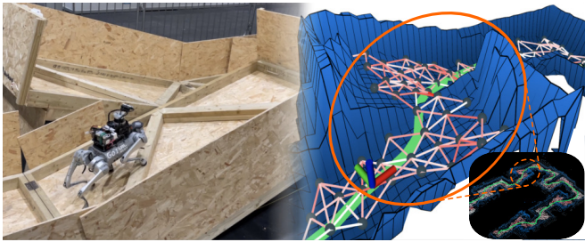

<p align="center">
  <h1 align="center">TRG-planner 🔫<br></h1>
  <h3 align="center">Traversal Risk Graph-Based Path Planning in Unstructured Environments for Safe and Efficient Navigation<br></h3>
  <p align="center">
    <a href="https://dklee98.github.io/" class="external-link" target="_blank" rel="noopener noreferrer">Dongkyu Lee</a>
    ·
    <a href="https://anahrendra.github.io/" class="external-link" target="_blank" rel="noopener noreferrer">I Made Aswin Nahrendra</a>
    .
    <a href="https://scholar.google.com/citations?user=z9NkqOMAAAAJ&hl=ko" class="external-link" target="_blank" rel="noopener noreferrer">Minho Oh</a>
    .
    <a href="https://scholar.google.com/citations?user=PlvkYEAAAAAJ&hl=ko" class="external-link" target="_blank" rel="noopener noreferrer">Byeongho Yu</a>
    ·
    <a href="https://scholar.google.com/citations?user=NrWfJ1gAAAAJ&hl=ko&oi=ao" class="external-link" target="_blank" rel="noopener noreferrer">Hyun Myung</a>
  </p>  
</p>

<p align="center">
    </a>
    <br>
    <em>TRG-planner finds a safe and efficient path for ground-based robots in unstructured environments.<br></em>
</p>

-----

## 🚀 Stay tuned! Our code will be available (Feb, 2025)

### 📝 Citation
```
@article{lee2025trg,
      title     = {TRG-planner: Traversal risk graph-based path planning in unstructured environments for safe and efficient navigation},
      author    = {Lee, Dongkyu and Nahrendra, I Made Aswin and Oh, Minho and Yu, Byeongho and Myung, Hyun},
      journal   = {IEEE Robotics and Automation Letters},
      volume    = {10},
      number    = {2},
      pages     = {1736--1743},
      year      = {2025},
      publisher = {IEEE}
    }
```